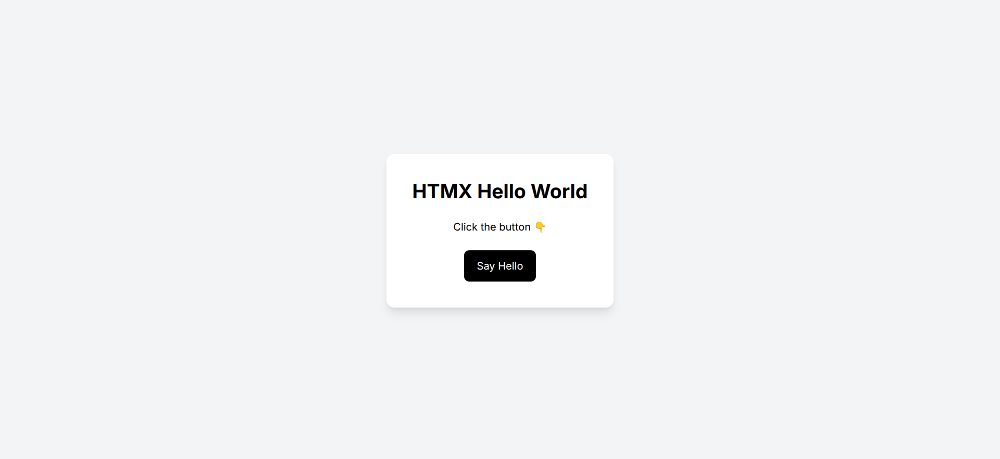

# 🚀 HTMX Hello World Practice



## 📌 About This Project

This project is my **first practice project using HTMX**.

The purpose of this project is to understand the core concepts of **HTMX with a server-driven approach** and learn how modern interactive web applications can be built without using frontend frameworks like React.

This practice demonstrates how a user action can trigger a request to the server, receive an HTML response, and update part of the page dynamically without a full page reload.

---

## 🛠️ Tech Stack

### Backend

- Node.js
- Express.js
- TypeScript
- Nunjucks Template Engine

### Frontend

- HTMX
- Tailwind CSS
- HTML

### Development Tools

- Nodemon
- TSX
- npm

---

## ✨ What I Learned

Through this first HTMX practice, I learned:

- How to set up HTMX with Express
- How HTMX sends requests to backend routes
- How to return HTML fragments from the server
- How `hx-get` works
- How `hx-target` updates specific elements
- How `hx-swap` controls HTML replacement
- Server-side rendering with Nunjucks
- Building interactive UI without JavaScript frameworks

---

## ⚡ How It Works

The application follows this flow:
User clicks button
|
↓
HTMX sends request
|
↓
Express receives request
|
↓
Server renders HTML fragment
|
↓
HTMX updates the page

No page refresh is required.

---

## 📂 Project Structure

practice1/
│
├── src/
│ └── server.ts
│
├── views/
│ ├── index.njk
│ └── partials/
│ └── message.njk
│
├── public/
│ ├── images/
│ │ └── image.png
│ │
│ └── css/
│ └── style.css
│
├── package.json
├── tsconfig.json
├── nodemon.json
└── README.md

---

## ⚙️ Installation

Clone the project:

```bash
git clone <repository-url>

# Install Dependencies
npm install

# Running project:
npm run dev
http://localhost:3000
```
